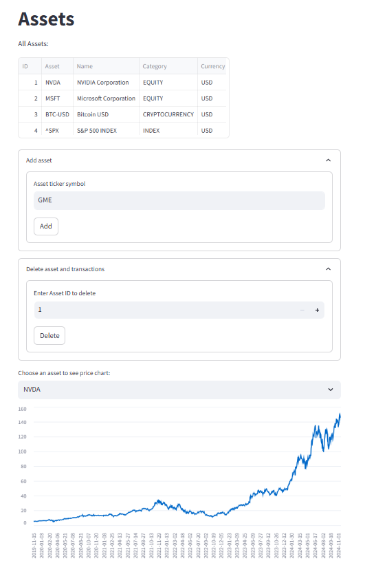
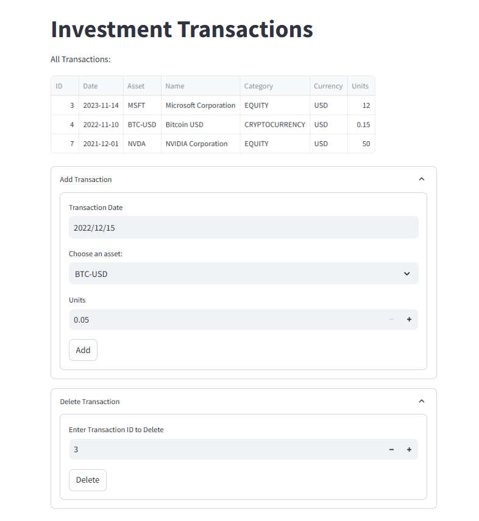
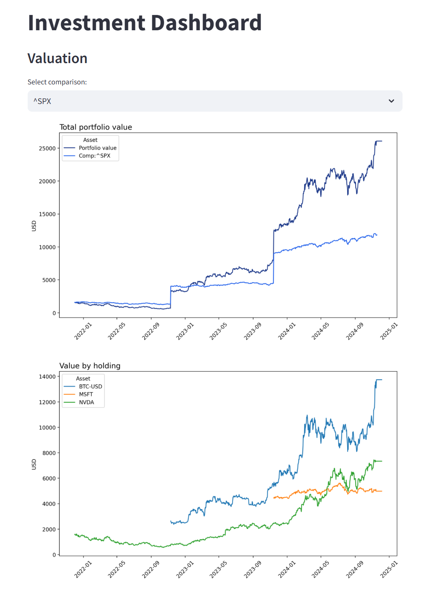
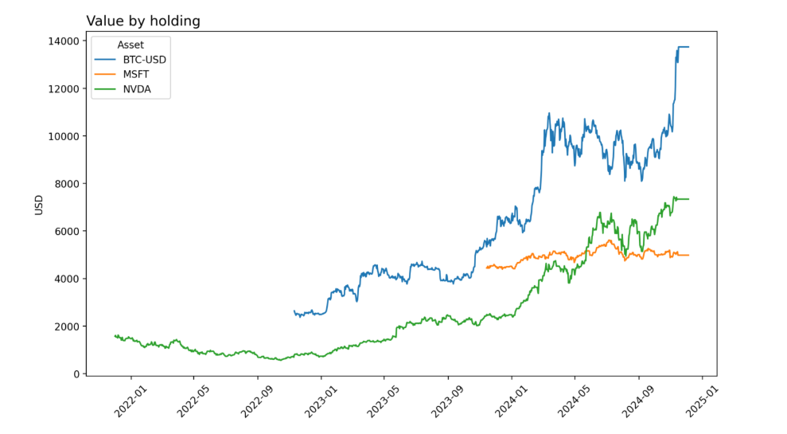

# Investment Dashboard: A Streamlit App for Portfolio Management

This project is an interactive investment dashboard built using Streamlit, enabling users to manage their financial portfolio by tracking transactions and value over time. The app integrates with Yahoo Finance to fetch market data and provides a clean, user-friendly interface for financial analysis.

## Motivation

### Hargreaves Lansdown lack of features
The Hargreaves Lansdown investment dashboard has three main limitations:
1. It does not show a simple graph of portfolio value over time.
2. The user is unable to bring other assets (e.g. crypto or cash) into the same view.
3. The user is limited to showing actual transactions, and cannot input hypothetical transactions for "what-if?" analysis.

I wanted to build a simple dashboard with these three features. 

### Learning objectives

Clearly, the other major motivation for creating this tool was my personal learning. I wanted to improve my skills in: 
1. Building web apps - Streamlit
2. Integrating with SQLite, including designing a suitable data model. 
3. Connecting to 3rd party APIs
4. Git
5. Unit testing
6. Project folder structure
7. Use of ChatGPT to efficiently write code

## Features

- Add, delete, and view investment transactions across multiple asset classes
- Fetch historical and real-time stock data via Yahoo Finance.
- Display visualizations such as portfolio value trends and asset breakdowns.
- Compare portfolio value over time with a comparator: show the value of your portfolio if you had invested exactly the same monetary amounts in the comparator instead of your own transactions
- Track asset returns, profits, and holdings by category.
- Support for multiple currencies and FX rate conversion.

## Technologies used

- Frontend: Streamlit
- Backend: SQLite
- APIs: Yahoo Finance (yfinance library)
- Programming Language: Python
- Visualization: Matplotlib, Pandas
- Testing: Unittest, Mock

## Set up instructions

### Prerequisites
- Python 3.9 or later
- Pip

### Installation
1. Clone the repository:
    ```bash
    git clone https://github.com/luoshanico/InvestmentDashboard.git
2. Navigate to the project directory
    ```bash
    cd InvestmentDashboard
3. Install required dependencies:
    ```bash
    pip install -r Investment_Dashboard.egg-info/requires.txt
4. Run the app:
    ```bash
    streamlit run bin/InvestmentDashboard.py
## Usage

#### **Step 1: Add assets**
You need to add assets before you can add transactions. Adding an asset simply downloads and stores the five year daily price history from Yahoo Finance.
- Navigate to "Assets" page
- Expand "Add asset"
- Type in the ticker code (If you don't know the relevant ticker symbol, then look on the Yahoo Finance website.)
- Press "Add" 

When the asset has downloaded successfully along with prices, you should be able to view the price history in the chart on the assets page

Note the prices are always converted into USD by default on download.

_In the screenshot below, the user has already added Nvidia, Microsoft, Bitcoin and the S&P500 Index assets. The user is in the process of adding Gamestop. The graph gives user comfort that prices have downloaded successfully and accurately._



#### **Step 2: Add transactions**
- Navigate to transactions page. 
- Choose asset for which you want to add transaction from the dropdown. All assets you have added to the app will appear here. 
- Select date and units to add the transaction. 

_In the screenshot below we are about to add a purchase of 0.05 Bitcoin in Dec'22. The summary table shows we already have three transactions saved._



#### **Step 3: View Dashboard**
- Navigate to dashboard page.
- Dashboard should have updated to show various visuals/metrics of your portfolio.

_Screenshots below show two of the charts on the dashboard. In the first chart, the user has chosen to compare their portfolio transactions with equivalent transactions in the S&P500 index. In this case, the user has outperformed the S&P500._




#### **Deleting data**
- You can delete individual transactions via the transactions page
- You can delete assets (and all related transactions) via the assets page
- You can reset the entire database (deletes all assets and transactions) from the Reset page
- You can not edit transactions, they must be deleted and re-added. 


## Testing
- How to run tests:

  ```bash
  pytest tests/

## Challenges faced

#### **1. Data model choice**

On the first draft of the app, I did not have a table for _Assets_. I only had _Transactions_ and _Prices_, using the list of unique assets from _Transactions_ as the source for the list of assets. This approach ran into two problems:

1. When adding transactions, the user needed to type in the ticker code accurately every time. The app would also have needed to make some call to Yahoo Finance to verify the ticker code. After I added the assets table, the user only need to type the ticker code once and API calls were minimized.
2. There was no way to have an asset and its prices stored in the database without a transaction. This makes it difficult to offer comps or hypothetical transactions. 

Updating the data model to include an Assets table made it easier to code additional functionality and made the app more user-friendly and intuitive. 

#### **2. Debugging**

I had a lot of trouble configuring launch.json to enable basic debugging using line breaks. I tried various different configurations recommended by ChatGPT. None allowed me to insert line breaks in VS Code that would trigger on manipulation of the app through the browser.

Only when writing up this readme did I finally find this tutorial https://ploomber.io/blog/streamlit-debugging/ which works perfectly. That would have made development a lot easier!

Lesson learned on relying too heavily on ChatGPT. Googling still has an edge in some cases. 

#### **3. Unit testing**

I used Unittest MagicMock and patch to unit test the transactions page. I had difficulties getting the unit tests to run correctly. In particular, there was an issue where MagicMock was returning mocked objects rather than the specified return value of the mocked object. This caused my tested functions to fail. I finally resolved this by updating the app code so that the transactions page function took optional parameters which I could then pass directly into the function when testing, instead of using mocked objects. I do not think this would be a good solution for a more complicated app and would be interested to understand a better solution. 


## Future enhancements

- Add OAuth for user authentication and secure data storage.
- Enable export of reports to CSV/Excel.
- Enable import of transactions/asset data via CSV/Excel
- Additional dashboard visuals
- Additional complexities of real world investing:
    - Transaction fees / management fees
    - Dividends
    - Stock splits / stock buy backs
    - Inflation adjusted returns
- Deploy the app to the cloud (e.g., Streamlit Community Cloud, AWS, Heroku).


## Contributing
Contributions are welcome! Particularly any feedback on existing code. Feel free to open an issue or submit a pull request.

## License
This project is licensed under the MIT License - see the [LICENSE](LICENSE) file for details.


